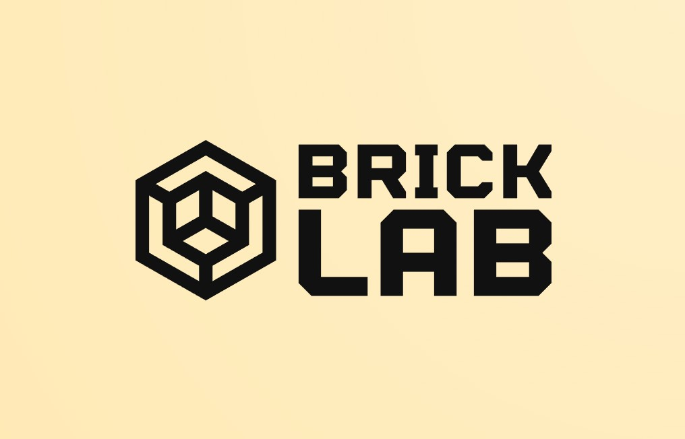

# Custom LEGO Sets with Rebrickable API 🧱

Welcome to our project! We're using the power of the Rebrickable API to customize LEGO sets. This project is built with React and Typescript. 

## Project Description 📝

This project is all about maximizing the use of your LEGO sets. We're leveraging the community-driven database provided by Rebrickable, which helps LEGO enthusiasts find new ways to build models using the pieces they already have. 

Our goal is to allow users to customize their existing LEGO sets, search for parts that belong to a specific set, add other LEGO parts to the set, and save their customized sets.

## Open Source 🌍

This is an open source project. That means anyone can copy, modify, or distribute the project code, even for commercial purposes. So feel free to clone the repository, play around with the code, or even contribute to the project!

## Features 💡

- **Customize LEGO Sets**: Make your LEGO sets unique by adding new parts and pieces.
- **Search Parts**: Easily find all the parts that belong to a specific set.
- **Add Parts**: Expand your sets by adding other LEGO parts.
- **Save Customized Sets**: Keep track of your creations by saving your customized sets.

## API 🌐

We're using the Rebrickable API to gather the data we need for this project.

## Getting Started 🚀

Follow these steps to get this project up and running on your local machine:

1. **Clone the Repository**: First, clone this repository to your local machine using `git clone`.

```bash
git clone <repository-url>
```

2. **Navigate to the Project Directory**: Use the cd command to navigate into the root directory of the project.
``` cd <project-directory> ```

3. **Install Dependencies**: Now, you can install the necessary dependencies for the project. Make sure you have Yarn installed on your machine. Run the following command to install the dependencies:

``` yarn install ```

4. **Start the Project**: Finally, you can start the project using the yarn start command. This will start the project in development mode. Open http://localhost:3000 to view it in the browser.

``` yarn start ```

5. **REMINDER**: ⚠️ In order to create / have your own profile user list, you need to login with your existing account from Rebrickable

That’s it! You should now have the project running locally on your machine. Happy coding! 🎉

## Contributing 🤝
Instructions about how to contribute, coding standards, and rules for submitting Pull Requests to the project.

## License 📄
This project is licensed under the MIT License - see the LICENSE.md file for details

## Acknowledgments 🙏
LEGO, for their amazing and creative toys.
Rebrickable, for their comprehensive LEGO database and API.
Happy Building! 🎉

